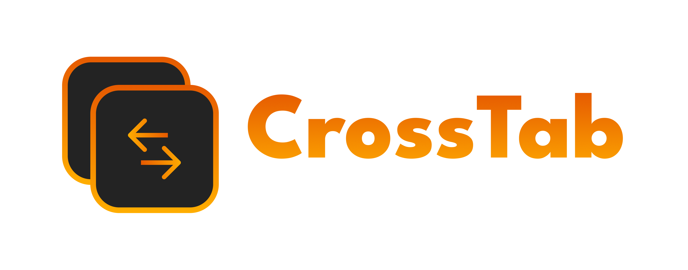

<div align="center">

[](https://github.com/Lorenzo0111/CrossTab/releases/latest)
[](LICENSE)
[](https://discord.gg/HT47UQXBqG)

  <hr />

<a href="https://deploy.workers.cloudflare.com/?url=https://github.com/Lorenzo0111/CrossTab"></a>

</div>

CrossTab is a tab synchronization solution that allows you to sync your tabs across different devices. It consists of a browser extension for your browser and a serverless API backend powered by Cloudflare Workers.

## Features

- 🔄 **Cross-Browser Tab Sync**: Sync tabs between browsers
- 🌐 **Multi-Device Support**: Access your tabs from any device
- ⚡ **Real-time Synchronization**: Instant tab updates across devices
- 🔒 **Secure**: Token-based authentication for secure data transfer
- ☁️ **Serverless**: Powered by Cloudflare Workers for global performance
- 🎯 **Smart Deduplication**: Avoids opening duplicate tabs

## Architecture

The project consists of two main components:

1. **Browser Extension** (`/extension/`) - Browser extension for tab management
2. **API Backend** (`/api/`) - Cloudflare Workers-based REST API

## Getting Started

### Prerequisites

- [Bun](https://bun.sh/) or Node.js for API development
- [Wrangler CLI](https://developers.cloudflare.com/workers/wrangler/) for Cloudflare Workers deployment
- Browser for extension testing

### API Setup

1. Navigate to the API directory:

   ```bash
   cd api
   ```

2. Install dependencies:

   ```bash
   bun install
   ```

3. Configure Cloudflare KV namespace:

   - Create a KV namespace in your Cloudflare dashboard
   - Update the `kv_namespaces` binding in `wrangler.jsonc`

4. Start development server:

   ```bash
   bun run dev
   ```

5. Deploy to Cloudflare Workers:
   ```bash
   bun run deploy
   ```

## API Endpoints

### Base URL

```
https://your-worker.your-subdomain.workers.dev
```

### Endpoints

- `GET /` - Health check
- `GET /tabs` - Retrieve all synchronized tabs
- `POST /tabs` - Add/update tabs from current device
- `GET /devices` - List all registered devices
- `POST /devices` - Register a new device

## Usage

1. **Setup**: Configure the extension with your API URL and token
2. **Sync**: Click "Sync Now" to manually sync tabs or enable automatic syncing
3. **View**: See tabs from other devices in the extension popup
4. **Open**: Click "Open Remote Tabs" to open tabs from other devices

## Technology Stack

### Backend

- **Runtime**: Cloudflare Workers
- **Framework**: Hono.js
- **Validation**: Zod
- **Storage**: Cloudflare KV
- **Language**: TypeScript

### Extension

- **Manifest**: Version 3
- **Framework**: WXT
- **UI**: React

## Development

### API Development

```bash
# Start development server
bun run dev

# Generate TypeScript types for Cloudflare bindings
bun run cf-typegen

# Deploy to production
bun run deploy
```

### Extension Development

```bash
# Start development server (Chrome)
bun run dev

# Start development server (Firefox)
bun run dev:firefox
```

## Configuration

### Environment Variables (API)

The API uses Cloudflare KV for data persistence. Configure the following in your Wrangler environment:

- `CROSSTAB_KV` - KV namespace binding for storing tabs and device data

### Extension Settings

- **API URL**: Your Cloudflare Workers endpoint
- **Auth Token**: Bearer token for API authentication
- **Device Name**: Identifier for the current device

## Security

- All API requests require Bearer token authentication
- CORS is configured to allow cross-origin requests
- Data is stored securely in Cloudflare KV with proper access controls

## License

This project is licensed under the MIT License - see the [LICENSE](LICENSE) file for details.